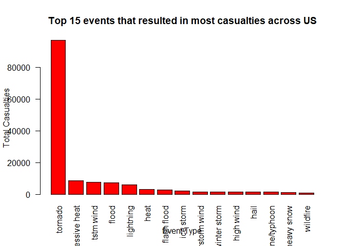
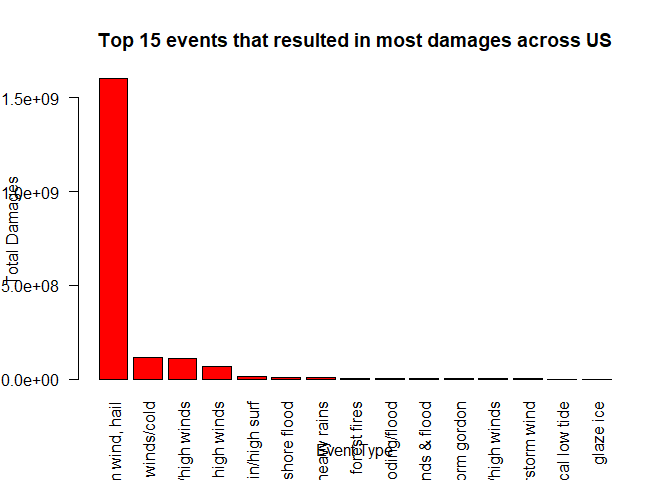

## Synopsis
Storms and other severe weather events can cause both public health and economic problems for communities and municipalities. Many severe events can result in fatalities, injuries, and property damage, and preventing such outcomes to the extent possible is a key concern.

This project involves exploring the U.S. National Oceanic and Atmospheric Administration's (NOAA) storm database. This database tracks characteristics of major storms and weather events in the United States, including when and where they occur, as well as estimates of any fatalities, injuries, and property damage.

The basic goal of this study is to explore the NOAA Storm Database and answer the following questions about severe weather events.

1. Across the United States, which types of events (as indicated in the EVTYPE variable) are most harmful with respect to population health?
2. Across the United States, which types of events have the greatest economic consequences?

## Data Processing

Following libraries are used to analyse the data

```r
library(dplyr)
```

```
## Warning: package 'dplyr' was built under R version 3.4.3
```

```
## 
## Attaching package: 'dplyr'
```

```
## The following objects are masked from 'package:stats':
## 
##     filter, lag
```

```
## The following objects are masked from 'package:base':
## 
##     intersect, setdiff, setequal, union
```

The data is loaded and event types are processed. Each event type entry is converted to lower case and then converted to factors. It was found that the data had some instances of same event types in both upper and lower cases resulting in 2 factors of the same type. 


```r
data <- read.csv("StormData.csv")
data$EVTYPE <- tolower(data$EVTYPE)
data$EVTYPE <- as.factor(data$EVTYPE)
```

## 1. Across the United States, which types of events (as indicated in the EVTYPE variable) are most harmful with respect to population health?

First the data for injuries is aggregated

```r
injuries <- aggregate(list(data$INJURIES), by = list(data$EVTYPE), FUN = sum)
colnames(injuries) <- c("evtype", "injuries")
```

Then same is done for fatalaties

```r
fatalities <- aggregate(list(data$FATALITIES), by = list(data$EVTYPE), FUN = sum)
colnames(fatalities) <- c("evtype", "fatalities")
```

Finally, both data sets are merged by "evtype" and total casualties are calculated.

```r
casualties <- merge(injuries, fatalities, by = "evtype")
casualties <- cbind(casualties, total = casualties$injuries + casualties$fatalities)
```

Since the data is very large, only the top 15 events that resulted in most casualties are plotted.

```r
casualties <- arrange(casualties, desc(casualties$total))
casualties <- casualties[1:15, ]

barplot(height = casualties$total, names.arg = casualties$evtype, las = 2, col = "red", xlab="Event Type", ylab="Total Casualties", main="Top 15 events that resulted in most casualties across US")
```

<!-- -->

It is observed that "tornadoes" have caused the most casualties

## 2. Across the United States, which types of events have the greatest economic consequences?

Two variables are first created to inherit the data for property and crop damages from original dataset. A column is added to both datasets to calculate the total expenses and for now is populated with NAs.

```r
property_raw <- data[, c("EVTYPE", "PROPDMG", "PROPDMGEXP")]
property_raw <- cbind(property_raw, totalexp = NA)

crop_raw <- data[, c("EVTYPE", "CROPDMG", "CROPDMGEXP")]
crop_raw <- cbind(crop_raw, totalexp = NA)
```

First, the property data is processed. PROPDMG is multiplied with the factor in PROPDMGEXP (H -> 10^2, K -> 10^3, M -> 10^6, B -> 10^9). The values are stored in the column "totalexp" created previously.

```r
property_raw$totalexp[property_raw$PROPDMGEXP=='H' | property_raw$PROPDMGEXP=='h'] <- 
        property_raw$PROPDMG[property_raw$PROPDMGEXP=='H' | property_raw$PROPDMGEXP=='h'] * 10^2

property_raw$totalexp[property_raw$PROPDMGEXP=='K' | property_raw$PROPDMGEXP=='k'] <- 
        property_raw$PROPDMG[property_raw$PROPDMGEXP=='K' | property_raw$PROPDMGEXP=='k'] * 10^3

property_raw$totalexp[property_raw$PROPDMGEXP=='M' | property_raw$PROPDMGEXP=='m'] <- 
        property_raw$PROPDMG[property_raw$PROPDMGEXP=='M' | property_raw$PROPDMGEXP=='m'] * 10^6

property_raw$totalexp[property_raw$PROPDMGEXP=='B' | property_raw$PROPDMGEXP=='b'] <- 
        property_raw$PROPDMG[property_raw$PROPDMGEXP=='B' | property_raw$PROPDMGEXP=='b'] * 10^9
```

The property damages are then aggregated for all event types

```r
property <- aggregate(list(property_raw$totalexp), by = list(property_raw$EVTYPE), FUN = sum)
colnames(property) <- c("evtype", "propexp")
```

Then, the crop data is processed. CROPDMG is multiplied with the factor in CROPDMGEXP (H -> 10^2, K -> 10^3, M -> 10^6, B -> 10^9). The values are stored in the column "totalexp" created previously.

```r
crop_raw$totalexp[crop_raw$CROPDMGEXP=='H' | crop_raw$CROPDMGEXP=='h'] <- 
        crop_raw$CROPDMG[crop_raw$CROPDMGEXP=='H' | crop_raw$CROPDMGEXP=='h'] * 10^2

crop_raw$totalexp[crop_raw$CROPDMGEXP=='K' | crop_raw$CROPDMGEXP=='k'] <- 
        crop_raw$CROPDMG[crop_raw$CROPDMGEXP=='K' | crop_raw$CROPDMGEXP=='k'] * 10^3

crop_raw$totalexp[crop_raw$CROPDMGEXP=='M' | crop_raw$CROPDMGEXP=='m'] <- 
        crop_raw$CROPDMG[crop_raw$CROPDMGEXP=='M' | crop_raw$CROPDMGEXP=='m'] * 10^6

crop_raw$totalexp[crop_raw$CROPDMGEXP=='B' | crop_raw$CROPDMGEXP=='b'] <- 
        crop_raw$CROPDMG[crop_raw$CROPDMGEXP=='B' | crop_raw$CROPDMGEXP=='b'] * 10^9
```

The crop damages are then aggregated for all event types

```r
crop <- aggregate(list(crop_raw$totalexp), by = list(crop_raw$EVTYPE), FUN = sum)
colnames(crop) <- c("evtype", "cropexp")
```

Lastly, both data sets are merged into one and total expenses (crop damage + property damage) are evaluated.

```r
totaldmg <- merge(crop, property, by = "evtype")
totaldmg <- totaldmg[!is.na(totaldmg$cropexp) | !is.na(totaldmg$propexp),]
totaldmg <- cbind(totaldmg, totalexp = totaldmg$cropexp + totaldmg$propexp)
```

The data is arranged so as to bring the events with the most damage on top. A barplot is made to examine the results for the top 15 events with most damages.

```r
totaldmg <- arrange(totaldmg, desc(totaldmg$totalexp))
totaldmg <- totaldmg[1:15, ]

barplot(height = totaldmg$totalexp, names.arg = totaldmg$evtype, las = 2, col = "red", xlab="Event Type", ylab="Total Damages", main="Top 15 events that resulted in most damages across US")
```

<!-- -->

It is observed that tornadoes, tstm wind, and hail have caused the most damages.
